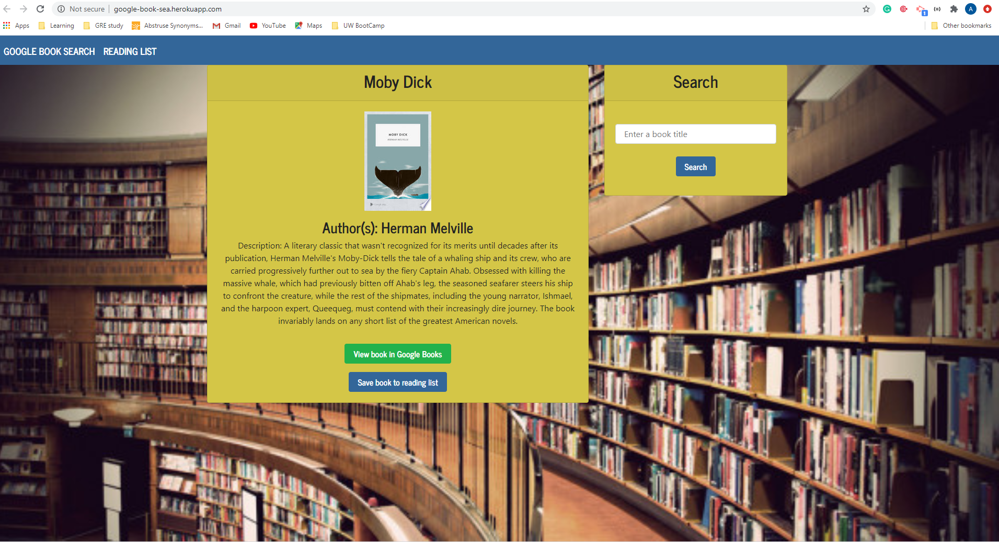

# Google-Search-Book

  

---

  ## Description:
   Using this app user will be able to serach their favorite books with google books. This is a Mern application

---

  

   Link to active site: https://google-book-sea.herokuapp.com/
  
---

  ## Table of Contents:
  *[Installation](#Installation) 
  *[Usage](#Usage)
  *[License](#License)
  *[Contributing](#Contribution)
  *[Tests](#Tests) 
  *[Questions](#Contact-Information)

---

  ## Installation:

  * Clone repository from Github at https://github.com/Arati15/Google-Search-Book. 
  * NPM  install dependencies.

---

  ## Usage:

  Search Google books 

---

  ## License
  License used for this project - MIT
    

  ## Contributing:

  Clone repository, make changes and make a pull request.

---

  ## Tests:
  No test

---

  ## Contact Information:
    *GitHub Username: Arati15